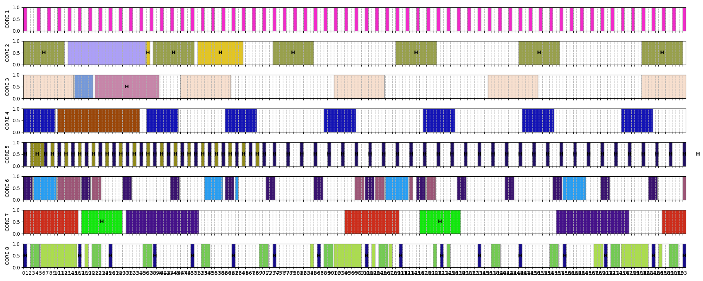

# Drone scheduling algorithm

This project is a scheduler algorithm based on UUNIFAST task generator, which uses combination of EDVFS and EDF algorithms for scheduling on 8 cores.

Here is a sample generated using 20 tasks in 200 time units:

